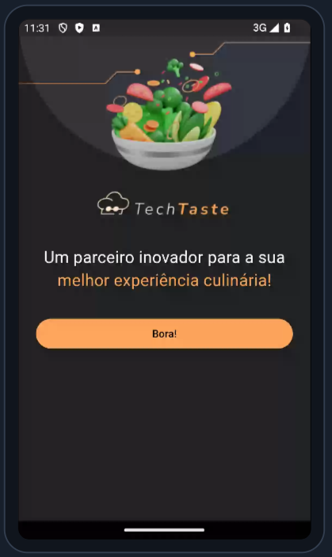
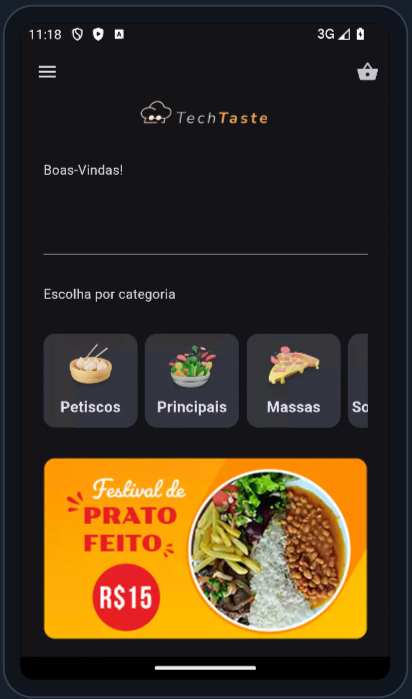
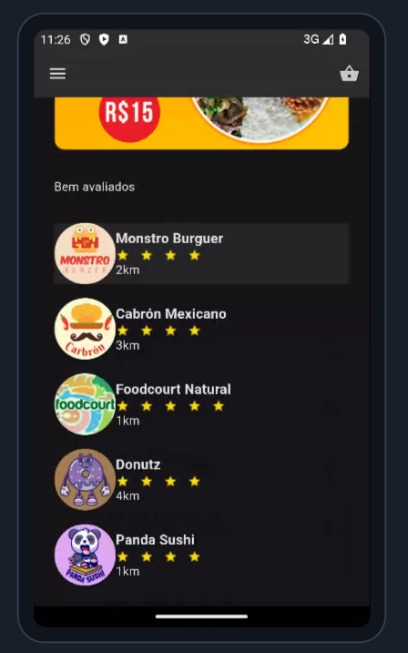
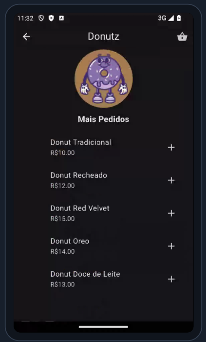
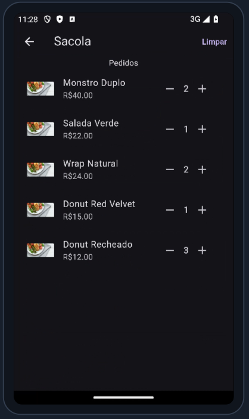
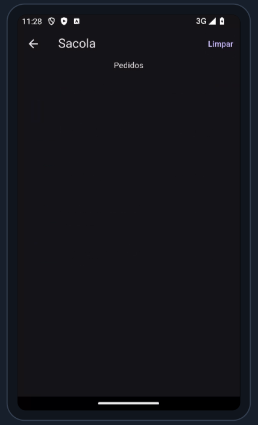

# TechTaste 🥗

**TechTaste** é um app de pedidos de comida desenvolvido durante a **Imersão Monile_ da Alura**. Foi o meu **primeiro projeto mobile e com Dart e Flutter**, onde explorei as ferramentas do **Firebase Studio** para integrar recursos como autenticação e armazenamento de dados. Segui um projeto guiado, mas estou empolgada para continuar evoluindo a aplicação com novas funcionalidades.


## 💻 Tecnologias Utilizadas

<p align="left">
  
  
  
</p>

## 📷 Prévia do App
<p align="center">
  
  
  
</p>
<p align="center">
  
  
  
</p>

##

## 📲 Funcionalidades

- Splash screen com imagem e botão  
- Navegação para a Home  
- Criação da estrutura base do projeto  
- Organização de temas e cores  
- Tela inicial com AppBar, Drawer e campo de busca  
- Lista de restaurantes dinâmica com Provider  
- Criação de widgets reutilizáveis (categorias e restaurantes)  
- Leitura de dados a partir de um JSON local  
- Adição e remoção de itens no carrinho  
- Simulação de pedido  
- Integração com Firebase  
- **Gerenciamento de estado com Provider**  

---

## 🎨 Design

O design do app foi criado pela equipe da Alura. Você pode conferir o protótipo completo no Figma:

🔗 [Figma do TechTaste - Imersão Flutter](https://www.figma.com/design/5WKjBnTvAKTraWTRqsjK02/TechTaste-%7C-Imers%C3%A3o?node-id=7-47&p=f&t=oHwKOX6WZF6d9BSV-0)

> Embora algumas telas e funcionalidades do Figma não tenham sido abordadas nas aulas, elas são uma ótima inspiração para futuras melhorias no app! ✨

## 🔧 Como Rodar Localmente

Para rodar o projeto localmente, basta seguir os passos abaixo:

```bash
git clone https://github.com/IngridSR95/Flutter-TechTaste.git
cd Flutter-TechTaste
flutter pub get
flutter run
```

**Requisitos:**
- **Flutter SDK instalado**
- **ou** acesso ao **Firebase Studio**

## 💡 Aprendizados

Durante o desenvolvimento deste projeto, aprendi a:

- Estruturar um app com Flutter
- Navegar entre telas no Flutter
- Consumir dados utilizando o Firebase
- Gerenciar o estado da aplicação com o Provider
- Criar uma UI simples e acessível

---

> Desenvolvido por **Ingrid Santana Rodrigues**, em constante aprendizado e evolução no desenvolvimento mobile. 💜

[](https://www.linkedin.com/in/ingrid-santana-rodrigues-149750273/)

---
